# Trip management system

## Project Information

* **Project Name:** Hadassim Trip Manager
* **Purpose:** School Trip Management and Real-Time Tracking System

---

## Table of Contents

* [Introduction](#introduction)
* [System Overview](#system-overview)
* [System Features](#system-features)
* [Technologies Used](#technologies-used)
* [Setup and Execution](#setup-and-execution)
* [API Endpoints](#api-endpoints)
* [System Screens](#system-screens)

---

## Introduction

The Hadassim Trip Manager system is designed to support the management of school trips.
It allows tracking teachers and students in real time and provides a simple way to monitor group safety.

The system combines a backend server with a web-based interface, enabling both data management and live visualization.

---

## System Overview

The system supports the following operations:

* Managing teachers and students
* Assigning students to specific teachers
* Receiving location updates from external devices
* Displaying all locations on a map
* Monitoring distance between students and their teacher

---


## System Features

### Managing Teachers

The system allows adding new teachers and retrieving existing teacher data.

<details>
  <summary> Click here to view the process of adding a teacher (step by step)</summary>
  <br>
  
  #### 1. Database state before insertion
 Displays the teacher table in pgAdmin before registering the new teacher.
  <br>
  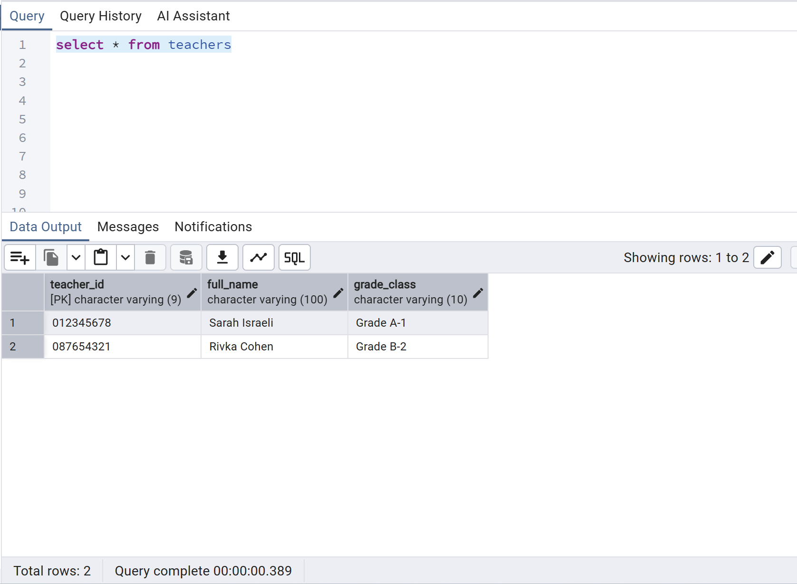

  #### 2. Fill out the registration form
 Entering teacher information in the user interface.
  <br>
  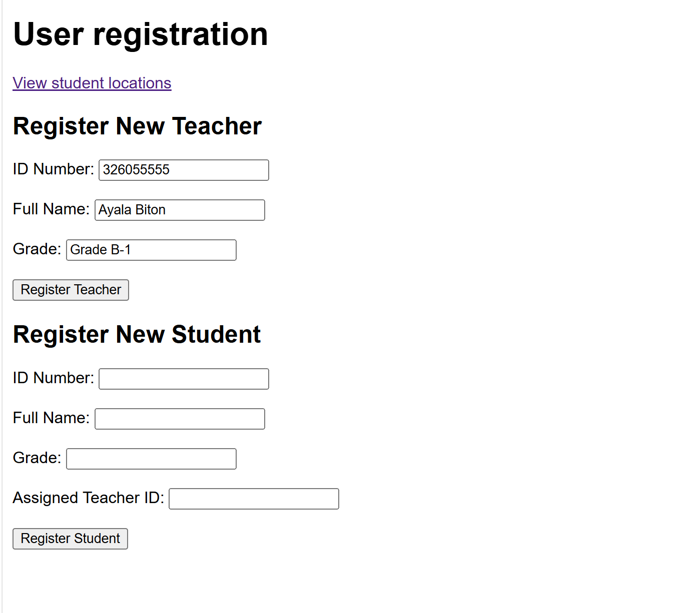

  #### 3. Confirmation of success
 Receive an Alert message confirming that the data was successfully sent to the API.
  <br>
  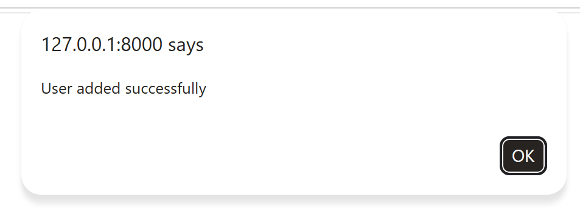

  #### 4. Final verification in the database
  You can see that the record was successfully added to the table.
  <br>
  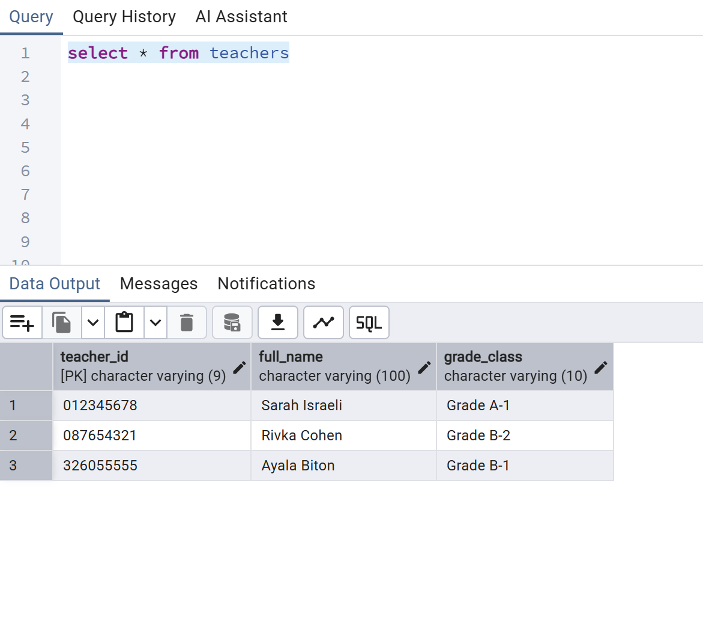

</details>


### Managing Students

It is possible to add students and assign each student to a teacher.

<details>
  <summary> Click here to view the process of adding a student (step by step)</summary>
  <br>
  
  #### 1. Database state before insertion
  Displays the students table in pgAdmin before registering the new student.
  <br>
  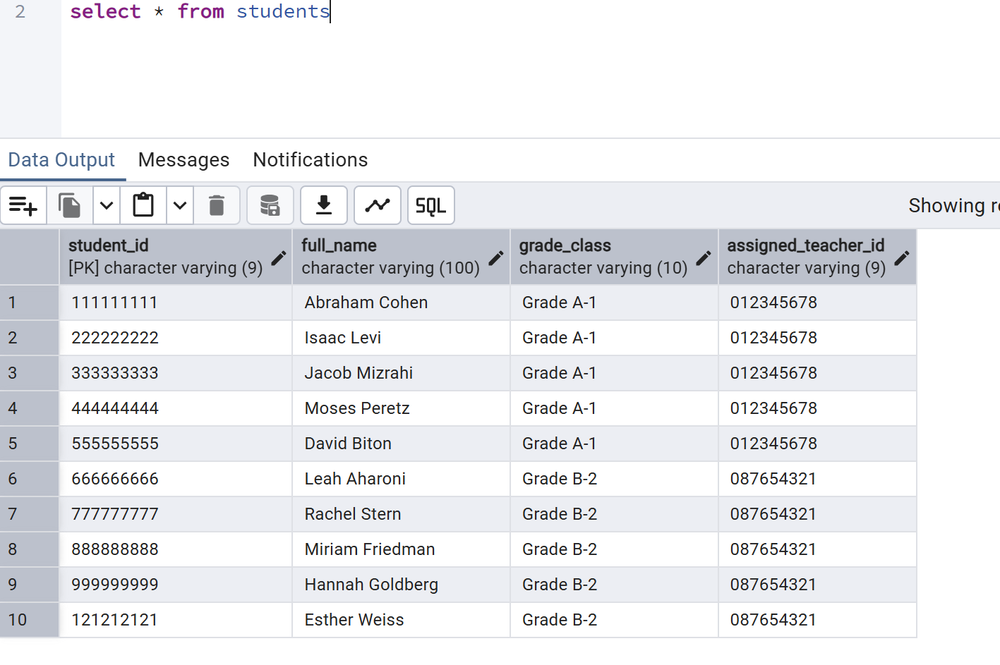

  #### 2. Fill out the registration form
  Entering student information and linking them to a teacher's ID in the user interface.
  <br>
  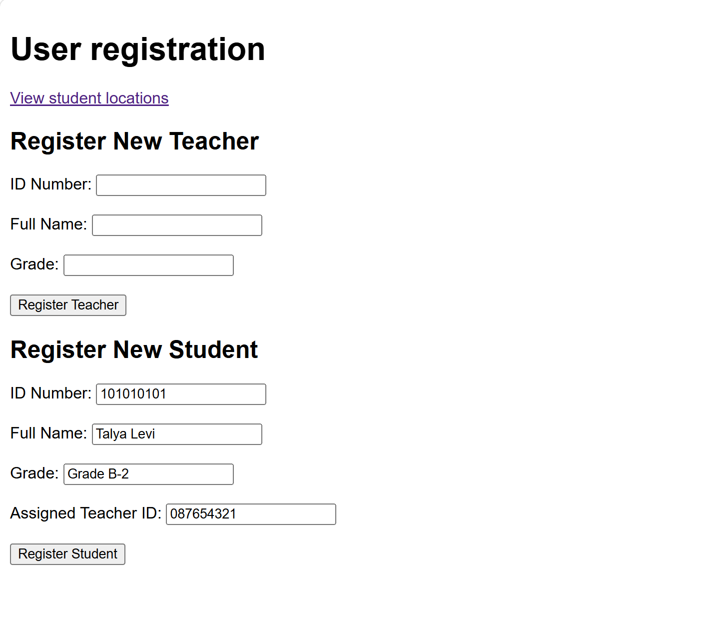

  #### 3. Confirmation of success
  A confirmation Alert appears, indicating the student has been successfully registered.
  <br>
  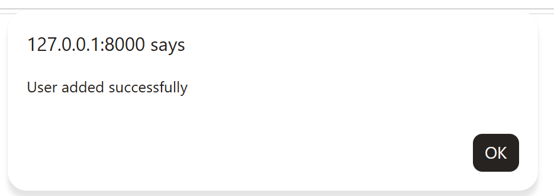

  #### 4. Final verification in the database
  Verification that the new student record appears in the PostgreSQL table with all relevant details.
  <br>
  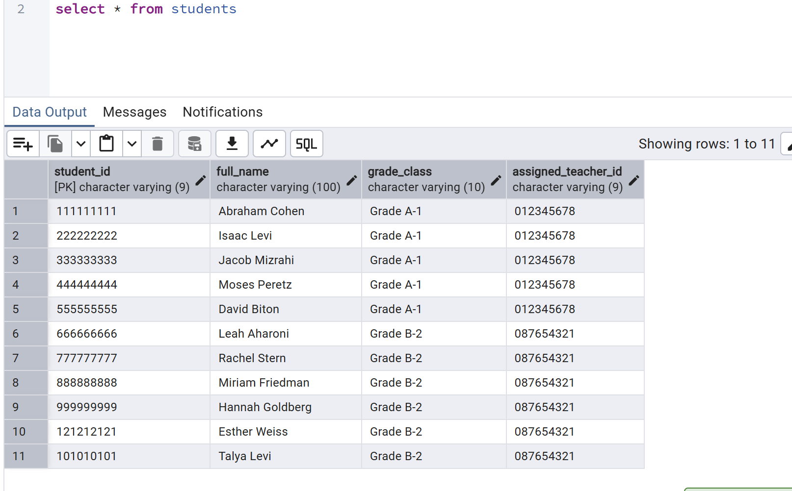

</details>


### API Operations (Swagger UI)

> ** Security Note:** Access to these administrative endpoints is restricted to authorized personnel. To ensure data privacy, every operation requires a valid **Teacher ID** to be provided as a mandatory parameter (`requesting_teacher_id`) before execution.

<details>
  <summary>Click here to view the API documentation (step by step)</summary>
  <br>

  #### 1. Retrieve All Teachers
  Retrieve the list of registered teachers from the database.
  
  **Request Input (Authorization):**
  <br>
  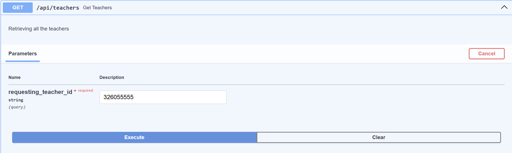
  
  **Response Output:**
  <br>
  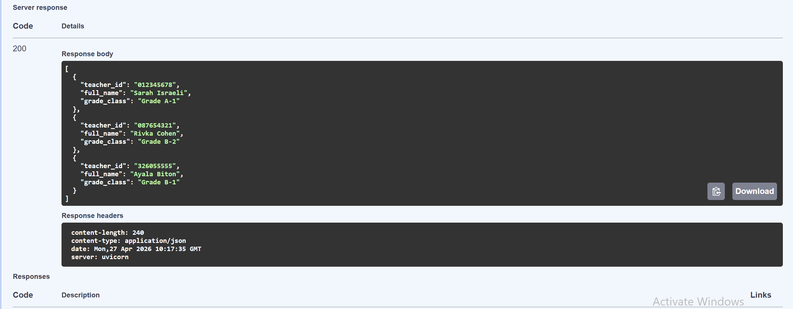

  <hr>

  #### 2. Retrieve All Students
  Retrieve the list of registered students from the database.
  <br>
  **Request Input:**
  <br>
  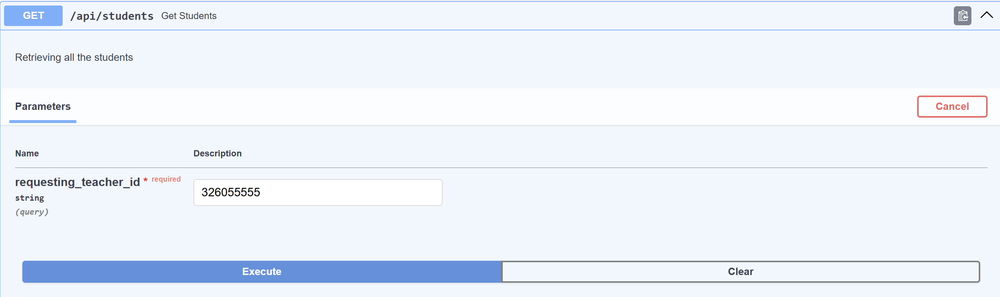
  
  **Response Output:**
  <br>
  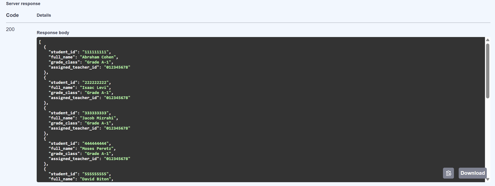

  <hr>

  #### 3. Search Records by ID
  Retrieving a specific profile based on a unique identification number.
  <br>
  **Teacher by ID (Input & Output):**
  <br>
  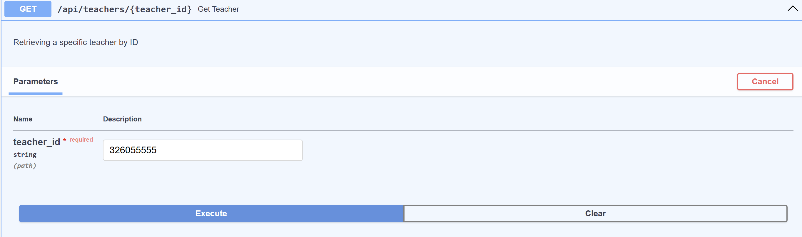
  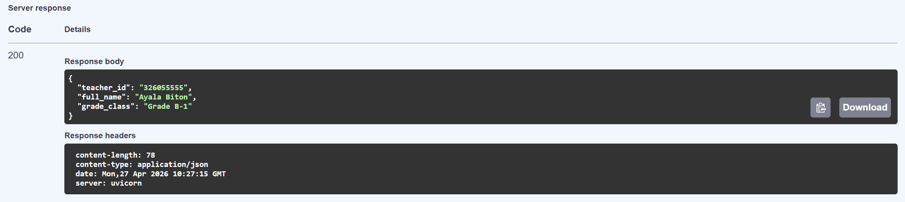

  <hr>

  #### 4. Search Records by ID
  Retrieving a specific profile based on a unique identification number.
  <br>
  **Student by ID (Input & Output):**
  <br>
  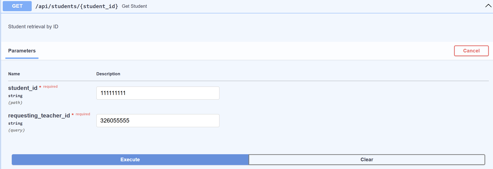
  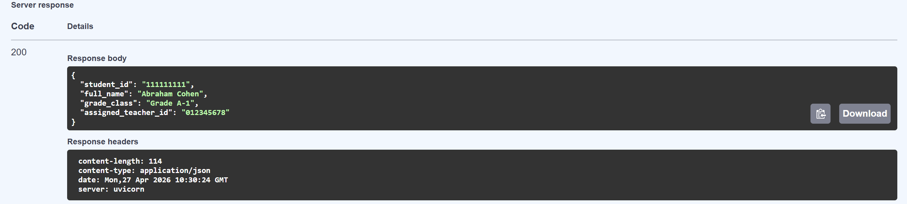

  <hr>

  #### 5. Advanced Filter: Students by Teacher
  A specialized query that returns only the students assigned to a specific instructor.
  <br>
  **Filter Input:**
  <br>
  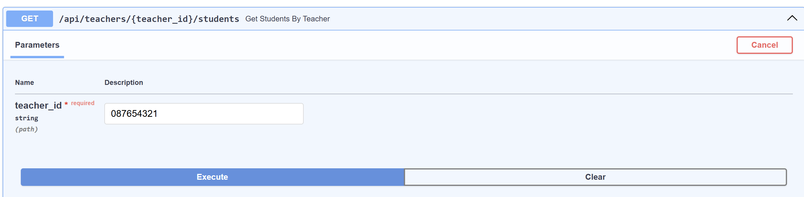
  
  **Filter Output:**
  <br>
  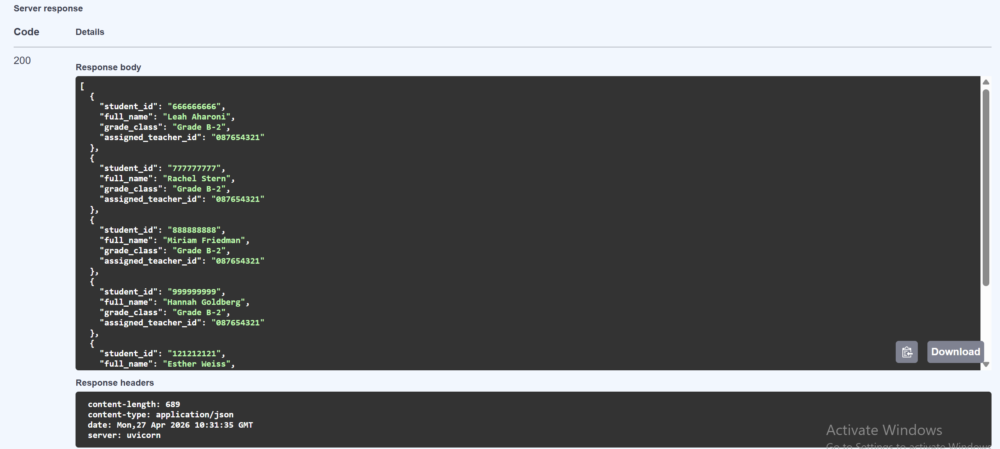

  <hr>

  #### 6. Add Location Record
  Recording new GPS coordinates for a student's or teacher's device. This operation simulates the data transmission from a GPS tracking device to the server.

  > **Technical Note:** The backend receives coordinates in **Degrees, Minutes, and Seconds (DMS)** format. It then utilizes a specialized utility function to convert these into **Decimal Degrees** before persisting the location data. Additionally, the system automatically calculates the distance from the teacher to determine if a safety alert should be triggered.

  **Request Input:**
  <br>
  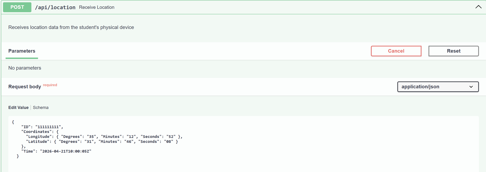
  
  **Response Output:**
  <br>
  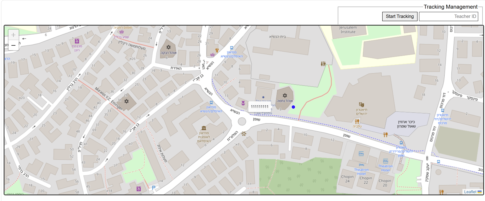

</details>

---

### Real-Time Map & Safety Monitoring

The interactive map, which provides real-time visualization of all students and teachers in the field.

#### 1. Global Monitoring View
This view displays the current location of every active device in the system, providing a high-level overview of the entire trip.

> **Technical Note:** The map is powered by **Leaflet.js** and uses **Polling** logic. It automatically sends a request to the server every 3 seconds to fetch the most recent coordinates without requiring a page refresh.

<br>
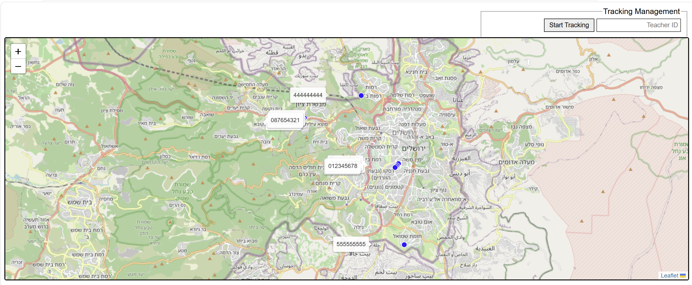

<hr>

#### 2. Class Filtering & Safety Alerts (Bonus )
To help teachers focus on their specific group, the system allows filtering by class. Additionally, the system automatically monitors the distance between the teacher and each student.

* **Distance Calculation:** The system calculates the air distance (in meters) between the teacher and students.
* **Safety Alert:** If a student moves more than **3 km** away from their teacher, their marker icon changes color to **Red**  to alert the teacher immediately.

**Filtered Class View with Safety Alert:**
<br>
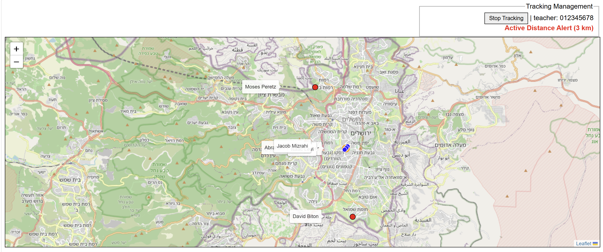
---

## Technologies Used

### Backend

* Python
* FastAPI
* PostgreSQL
* psycopg2

### Frontend

* HTML
* CSS
* JavaScript
* Leaflet.js

---

## Setup and Execution

### 1. Clone the project

```bash
git clone "קישור של הפרויקט"
cd HADASSIM-TRIP-MANAGER
```

### 2. Install dependencies

```bash
python -m venv .venv
.\.venv\Scripts\Activate.ps1
cd backend
pip install -r requirements.txt
```

### 3. Configure environment variables

Create a `.env` file inside the backend folder:

```
DB_HOST=localhost
DB_NAME=your_database
DB_USER=your_user
DB_PASSWORD=your_password
DB_PORT=5432
```

### 4. Run the server

```bash
uvicorn main:app --reload
```

### 5. Access the system

* Home page: http://127.0.0.1:8000/
* Map page: http://127.0.0.1:8000/map.html

---

## API Endpoints

### Teachers

* GET /api/teachers
* POST /api/teachers
* GET /api/teachers/{teacher_id}
* GET /api/teachers/{teacher_id}/students

### Students

* GET /api/students
* POST /api/students
* GET /api/students/{student_id}

### Location Tracking

* POST /api/location
* GET /api/locations
* GET /api/tracking/{teacher_id}

---
